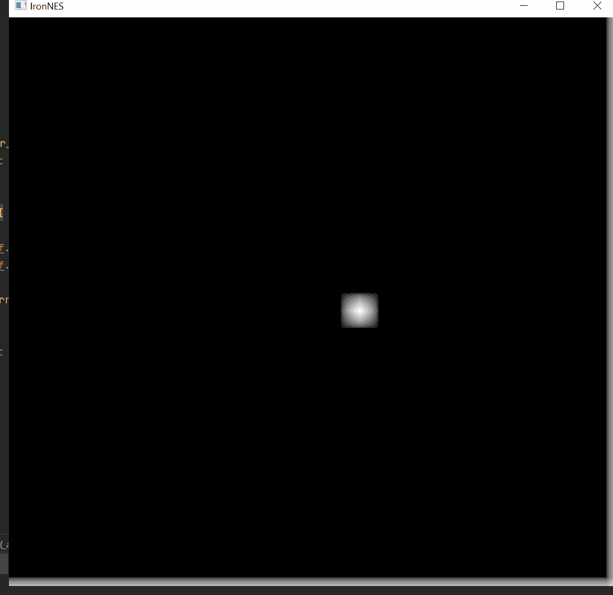

# IronNES - Rust NES Emulator

WIP NES emulator written in rust. This project is being written based on many great resources and tutorials 
including [OneLoneCoder NES Emulator](https://www.youtube.com/watch?v=F8kx56OZQhg) youtube videos, 
[NES Ebook](https://bugzmanov.github.io/nes_ebook/chapter_1.html) and many others. 

### Crawl: 
First multiplication using assembler [here](https://www.masswerk.at/6502/assembler.html)

### Walk: 
Running snake game found [here](https://bugzmanov.github.io/nes_ebook/chapter_3_4.html)

### Run:
Completed the nes specific instructions by running `nestest` and comparing with the nestest log 
found [here](https://raw.githubusercontent.com/christopherpow/nes-test-roms/master/other/nestest.log)

